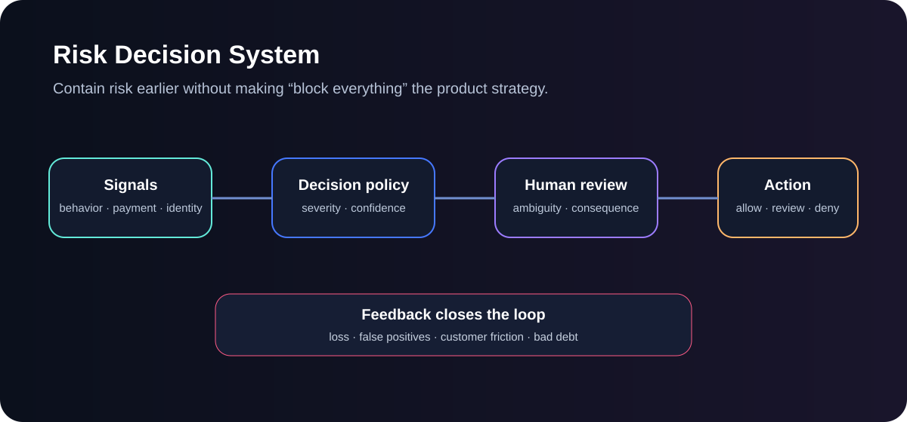

# Ash Intelligence Lab

## AI product systems for decisions that matter.

**20 runnable systems. Three questions. One product philosophy.**

I use this lab to prototype the product boundary around AI: **when a system should act, how we know it is working, and how evidence becomes a consequential decision without losing control or human judgment.**

**[▶ Open the live lab](https://ash-intelligence-lab.streamlit.app/)** · **[GitHub profile](https://github.com/AshIntelligence)** · **[Roadmap](docs/PRODUCT_ROADMAP.md)** · **[LinkedIn](https://www.linkedin.com/in/ashb27)**

| Pillar | The question |
|---|---|
| **CONTROL** | When should AI act, stop, or ask a human? |
| **EVALUATE** | How do we know the product is actually working? |
| **DECIDE** | How do we turn evidence and policy into explainable action? |

The projects are intentionally small enough to follow **input → decision → output**. Some are agent architecture experiments, some are product decision tools, and some make a platform or fintech tradeoff executable so I can test the assumption rather than only describe it.

---

## Start here — three flagship systems

### CONTROL · Agent Control Plane

[](https://github.com/AshIntelligence/agent-control-plane)

**Product question:** When is an agent actually allowed to act?

Registry, tool authorization, approval gates, evaluation thresholds, cost and incident budgets, rollout state and audit events live in one inspectable control surface.

**[▶ Try live](https://ash-intelligence-lab.streamlit.app/?product=agentic-product-control-plane)** · **[Standalone repo](https://github.com/AshIntelligence/agent-control-plane)** · **[Lab source](projects/agentic-product-control-plane/)**

### EVALUATE · MAUTAM — AI Product Evaluation

[](https://github.com/AshIntelligence/AI-Observability)

**Product question:** How do you decide whether an AI capability deserves to ship, tune, simplify or stop?

MAUTAM puts model quality beside adoption, workflow success, trust, availability and measurable impact so one good model score cannot hide a bad product.

**[▶ Try live](https://ash-intelligence-lab.streamlit.app/?product=mautam-evaluation)** · **[Standalone repo](https://github.com/AshIntelligence/AI-Observability)** · **[Lab source](projects/mautam-evaluation/)**

### DECIDE · Risk Decision System

[](https://github.com/AshIntelligence/risk-decision-system)

**Product question:** How do you contain risk earlier without turning protection into unnecessary customer harm?

Behavioral, payment and identity signals become explainable **ALLOW / REVIEW / BLOCK** decisions while policy thresholds, reason codes, review load and good-user harm stay visible.

**[▶ Try live](https://ash-intelligence-lab.streamlit.app/?product=fraud-signal-decision-engine)** · **[Standalone repo](https://github.com/AshIntelligence/risk-decision-system)** · **[Lab source](projects/fraud-signal-decision-engine/)**

---

## CONTROL — define the boundary of action

| System | What product decision it makes |
|---|---|
| **[Agent Control Plane](projects/agentic-product-control-plane/)** | Authorize tools and decide whether rollout should HOLD, CANARY or advance to PRODUCTION. |
| **[Agent vs Workflow Router](projects/agent-vs-workflow-router/)** | Choose deterministic workflow, assisted agent or autonomous agent from variability, consequence and state. |
| **[Human-in-the-Loop Risk Router](projects/human-in-loop-risk-router/)** | Decide when confidence is enough to act and when consequence requires human review. |
| **[Agent Tool Permission Policy](projects/tool-permission-policy-engine/)** | Make mutation risk, data sensitivity, role and approval state explicit before a tool can execute. |
| **[Finance Close Orchestrator](projects/finance-close-orchestrator/)** | Sequence dependency-bound finance work while keeping exceptions and controller approval as real workflow states. |

## EVALUATE — turn evidence into product action

| System | What it helps evaluate |
|---|---|
| **[MAUTAM](projects/mautam-evaluation/)** | Product-level AI health across quality, adoption, workflow, trust, availability and impact. |
| **[Grounded RAG Quality Gate](projects/rag-quality-gate/)** | Whether an answer is sufficiently supported and correctly cited before release. |
| **[Retrieval Evaluation Benchmark](projects/retrieval-eval-benchmark/)** | Precision@K, Recall@K, MRR and nDCG before generation obscures retrieval quality. |
| **[Customer Support Knowledge OS](projects/support-knowledge-os/)** | Whether available evidence is strong enough to answer or the product should escalate. |
| **[Telemetry Anomaly → Product Action](projects/telemetry-anomaly-to-action/)** | Which metric anomalies should change rollout, diagnosis or product priority. |
| **[Experiment Analysis Copilot](projects/experiment-analysis-copilot/)** | Whether experiment evidence supports SHIP, HOLD or STOP instead of treating significance as the whole decision. |
| **[Voice of Customer Synthesis](projects/voc-synthesis-studio/)** | Where qualitative pain and observed usage reinforce—or contradict—each other. |
| **[Evidence-Weighted Prioritization](projects/product-prioritization-engine/)** | How impact and evidence trade against effort, dependencies, control burden and opportunity cost. |
| **[PRFAQ Product Spec Agent](projects/prfaq-product-spec-agent/)** | Turn an early idea into an explicit promise, metrics, constraints, risks and open questions. |

## DECIDE — make consequential choices explainable

| System | What decision it makes |
|---|---|
| **[Risk Decision System](projects/fraud-signal-decision-engine/)** | Convert synthetic risk signals into explainable ALLOW / REVIEW / BLOCK states. |
| **[Payment Provider Onboarding](projects/payment-provider-onboarding/)** | Decide whether provider capabilities, regional support, risk and health are ready for launch. |
| **[Billing Reconciliation Observatory](projects/billing-reconciliation-observatory/)** | Find where usage → rating → invoice state diverges and surface the financial mismatch. |
| **[Incident Triage Agent](projects/incident-triage-agent/)** | Turn noisy symptoms into severity, owner and next action before generating narrative. |
| **[Career Discovery Ranking Study](projects/linkedin-career-discovery/)** | Rank synthetic opportunities using fit, growth direction, freshness and location preference. |
| **[Intentional Discovery Study](projects/instagram-intentional-discovery/)** | Re-rank a synthetic feed around relevance, novelty, diversity and a finite attention budget. |

### Plus: grounded document Q&A

The live lab also includes a document-intelligence playground that retrieves evidence first, answers from that evidence, cites the chunks and exposes its evaluation trace.

**[▶ Open the live lab](https://ash-intelligence-lab.streamlit.app/)**

---

## Why I build this way

A PRD can hide an assumption. A small executable system usually cannot.

I prototype far enough to test questions such as:

- Is an agent actually better than a deterministic workflow here?
- What state must remain authoritative outside the model?
- Which actions need approval, auditability or rollback?
- What metric would make me change the roadmap rather than merely report it?
- What happens when confidence is low, a dependency fails, or a decision is irreversible?
- Can another person trace why the system produced this outcome?

The goal is not maximum code. The goal is **product judgment you can inspect.**

## Run locally

```bash
pip install -r requirements.txt
streamlit run streamlit_app.py
```

Run the underlying systems without the UI:

```bash
python tools/run_systems.py
```

Or run one directly:

```bash
python projects/mautam-evaluation/main.py
python projects/mautam-evaluation/main.py --test
```

The Streamlit layer calls the original engines under `projects/`; it does not reimplement their decision logic.

## Repository map

- `projects/` — 20 compact decision systems
- `streamlit_app.py` — interactive demo hub
- `ui/` — adapters, scenarios and input guidance
- `agents/` — grounded document, job-research and product-design agents
- `core/` — retrieval, tool runtime, evaluation, tracing and LLM abstractions
- `evals/` — behavioral evaluation cases and results
- `tests/` — system, scenario, link and Streamlit coverage
- `docs/` — architecture, deployment and roadmap notes

All demos use synthetic or public-safe inputs.
