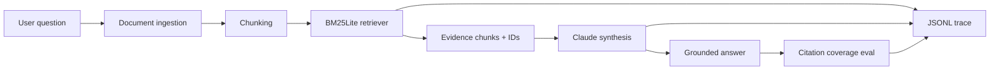
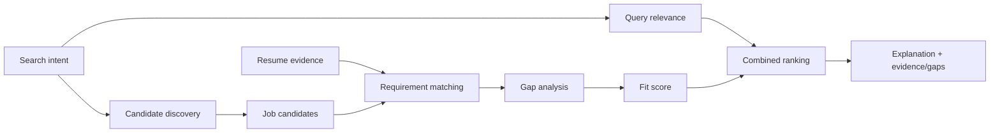
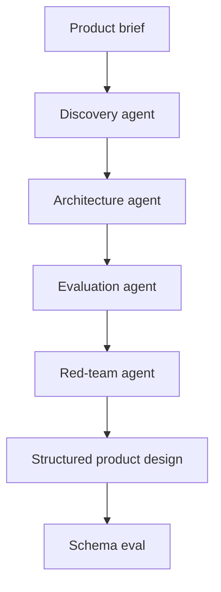

# Architecture

## Shared principles

1. **Decompose before prompting.** Different operations have different failure modes.
2. **Retrieve/tool first; synthesize second.** Fluent output is not evidence.
3. **Persist observable artifacts.** Traces and evals should survive the model call.
4. **Keep consequential actions gated.** The prototype can recommend; approval boundaries stay explicit.
5. **Design for model/provider failure.** Mock mode lets architecture and orchestration remain testable without an API.

## Document Intelligence

The local lexical retriever is intentional: it keeps the retrieval boundary simple, debuggable, deterministic, and replaceable by hybrid/vector retrieval later.

## Research / Job Discovery

Candidate-fit coverage and current query relevance are intentionally separate metrics.

## Product / Technical Design

Each stage has a distinct objective: user/problem clarity, system boundaries, measurable behavior, and failure discovery/control boundaries.
