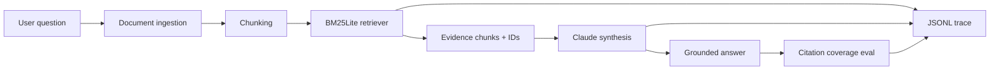
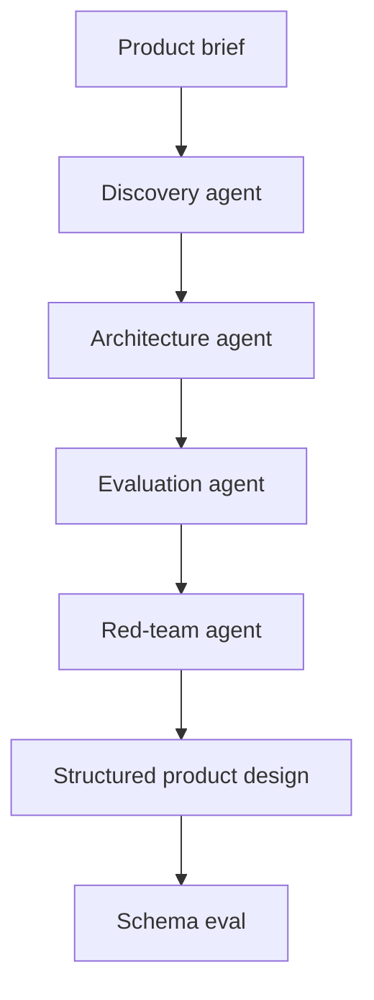

# Architecture

## Choices I reuse

1. Break work into stages when the stages fail differently.
2. Retrieve or call tools before asking a model to synthesize an answer.
3. Keep traces and eval results outside the model call so they can be reviewed later.
4. Put approval around high-impact actions instead of relying on model confidence alone.
5. Keep a deterministic mode so the orchestration can still be tested when a model provider is unavailable.

## Document Intelligence

The local lexical retriever keeps retrieval easy to test and easy to replace later with hybrid or vector search.

## Research / Job Discovery

Fit coverage and query relevance stay separate because they answer different questions.

## Product / Technical Design

The stages separate problem definition, architecture, evaluation and failure analysis instead of asking one model response to do all four jobs.
