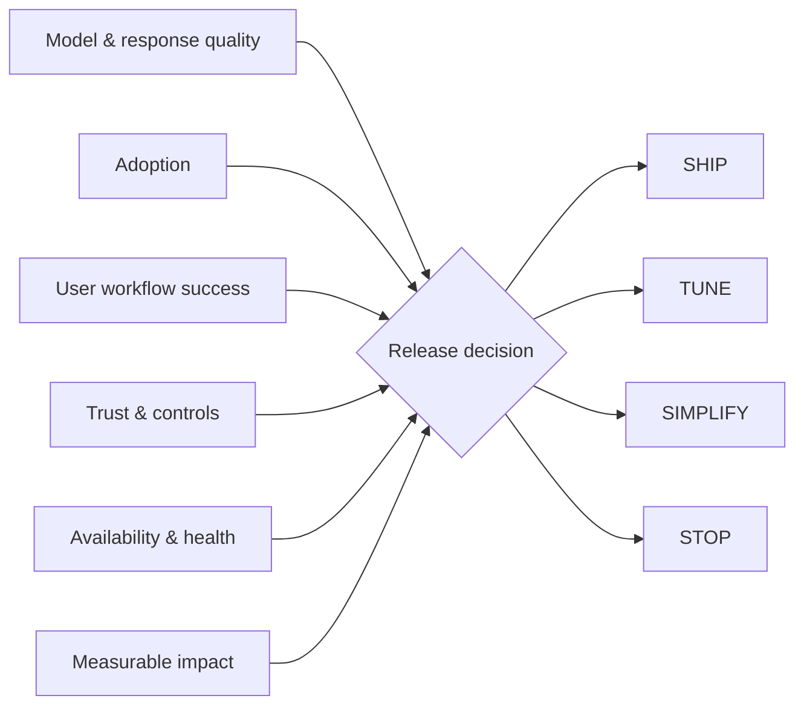

# MAUTAM AI Product Evaluation Lab

**AI Evaluation · runnable synthetic prototype**

MAUTAM turns six product-level lenses into a release decision: **SHIP / TUNE / SIMPLIFY / STOP**.

- **M**odel & Response Quality
- **A**doption
- **U**ser Workflow Success
- **T**rust & Controls
- **A**vailability & Health
- **M**easurable Business Impact

The point is deliberately product-level: an AI capability can look strong on response quality and still be a bad product if users do not complete the workflow, the control model is unsafe, or the system is operationally unreliable.

## Architecture



## Decision model

The prototype uses an explicit weighted score **plus hard safety/operational gates**. Trust and availability cannot be averaged away by a great model-quality score.

```text
weighted product score
        +
trust / availability hard gates
        ↓
SHIP · TUNE · SIMPLIFY · STOP
```

## Run

```bash
python main.py
python main.py --test
```

Example result:

```json
{
  "score": 0.816,
  "decision": "SHIP",
  "weakest_lens": "adoption"
}
```

## What I would measure in production

- grounded / task-relevant response quality
- workflow completion and exception rate
- repeat adoption by intended cohort
- human-review and policy-control effectiveness
- latency, availability and tool failures
- time-to-value / risk reduced / cost avoided / revenue protected

## Failure modes this framework is designed to catch

1. **Great demo, weak workflow:** the answer sounds good but users still finish the task manually.
2. **High adoption, low trust:** usage grows while permissions, reversibility or review controls remain weak.
3. **Strong offline evals, poor production health:** latency/tool failures make the product unusable.
4. **Interesting AI, no measurable value:** novelty becomes the roadmap instead of evidence.

## Production evolution

- consume real eval traces rather than hand-entered scores
- add cohort-level confidence intervals and trend windows
- version scorecards with model/prompt/retrieval/tool changes
- create online gates for canary → production rollout
- preserve a decision log explaining why a release moved forward or stopped

**Product thesis:** AI evaluation should answer *is this product actually working for the user and the business?*, not only *did the model pass a benchmark?*
