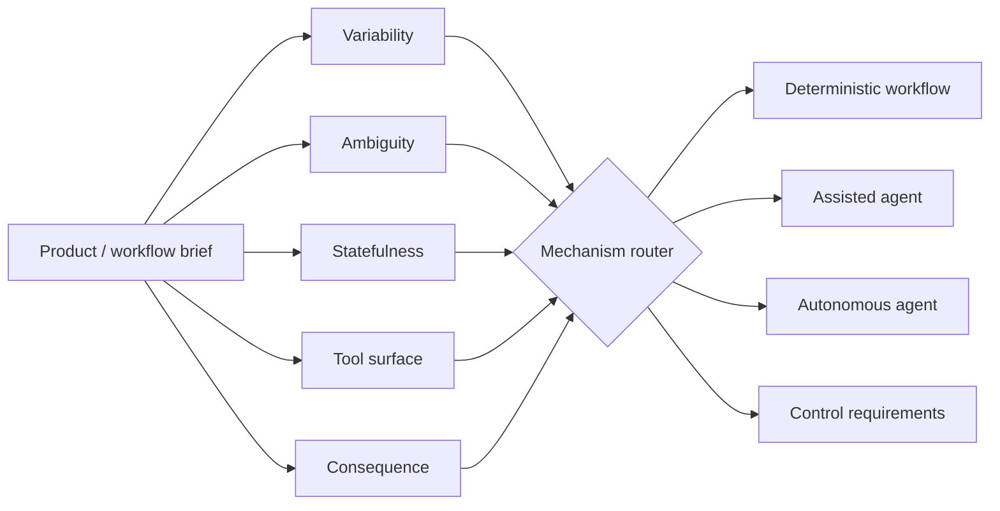

# Agent vs Workflow Router

**Agent Architecture · runnable synthetic prototype**

A small architecture decision engine for a question that product teams increasingly need to answer before they start building:

> **Should this be a deterministic workflow, an assisted agent, or an autonomous agent?**

The router looks at variability, ambiguity, statefulness, tool count and consequence. Consequence reduces autonomy even when the work is highly variable.

## Architecture



## Example decisions

```text
invoice-refund  → assisted-agent + human approval
research-brief  → autonomous-agent + tool allowlist + state checkpointing
data-export     → deterministic-workflow
```

## Why the controls are part of the output

Choosing the mechanism without choosing the control boundary is incomplete architecture. The prototype can attach:

- human approval
- tool allowlists
- state checkpointing

The same product task could move from assisted → autonomous later as eval evidence and reversibility improve.

## Run

```bash
python main.py
python main.py --test
```

## Product metrics

- task / workflow completion
- human override rate
- tool-error rate
- latency and cost per completed workflow
- escalation / rollback frequency
- user preference for agent vs deterministic surface

## Tradeoffs

- **More agency ≠ more value.** Predictable, high-volume work may be better as normal software.
- High consequence changes the acceptable autonomy threshold.
- Multi-step state can justify an agent, but also creates recovery complexity.
- A large tool surface creates both capability and blast radius.

## Production evolution

- calibrate scores from real workflow traces and incidents
- add privacy / data residency / latency / cost budgets
- add reversible-action simulation before high-impact execution
- measure whether changing the mechanism improves the user outcome

**Product thesis:** the strongest agentic product decision can be *do not build an autonomous agent here.*
