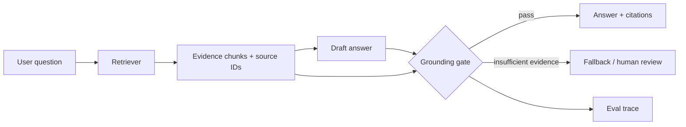

# Grounded RAG Quality Gate

**RAG / Evaluation · runnable synthetic prototype**

A pre-release gate for retrieval-augmented answers. It scores **evidence coverage, citation validity and contradiction risk** before allowing an answer to ship.

## Architecture



## Why a gate instead of another prompt

Prompting the model to “be grounded” is not an observable product control. The gate creates an explicit state transition:

```text
PASS   → answer may be released
REVIEW → evidence is insufficient / contradictory; degrade gracefully
```

## Run

```bash
python main.py
python main.py --test
```

The demo uses transparent lexical evidence overlap so the logic is easy to inspect. A production version should replace or augment this with semantic retrieval and entailment evaluation.

## Production metrics

- retrieval recall / precision
- grounded-answer rate
- citation precision and source coverage
- contradiction / unsupported-claim rate
- fallback rate
- downstream workflow success after the answer

## Failure modes

- retrieval finds a related document but not evidence for the actual claim
- citations exist but do not support the sentence they are attached to
- two authoritative sources disagree
- a high-confidence answer is generated from low-confidence retrieval
- fallback rate falls only because the system became less conservative

## Production evolution

- hybrid sparse + dense retrieval
- reranking and per-query retrieval evals
- source-level citation IDs and trace replay
- NLI / judge-model entailment with golden cases
- separate retrieval quality from answer quality in observability

**Product thesis:** when grounding is weak, the correct product behavior is often **I need more evidence**, not a more fluent answer.
