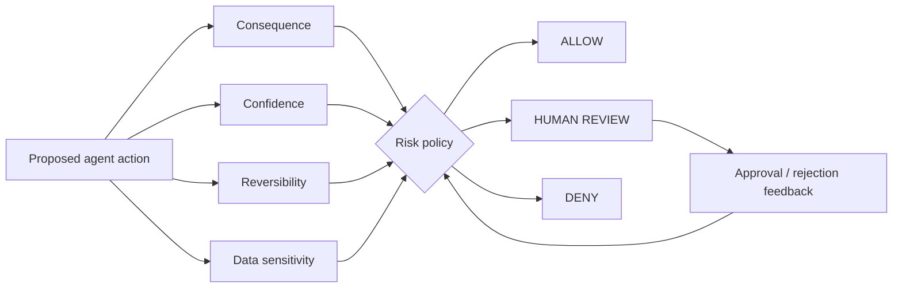

# Human-in-the-Loop Risk Router

**Trust / Safety · runnable synthetic prototype**

Routes a proposed AI/agent action to **ALLOW / REVIEW / DENY** using four product-level risk inputs:

- consequence
- model/system confidence
- reversibility
- data sensitivity

## Architecture



## Example

```text
draft-email    → ALLOW
delete-account → DENY
refund         → ALLOW or REVIEW depending on amount/context policy
```

## Run

```bash
python main.py
python main.py --test
```

## Why reversibility matters

Two actions with the same confidence should not necessarily receive the same autonomy. A wrong draft can be edited. A wrong transfer, deletion or external publication can have materially different consequences.

## Product metrics

- false auto-allow rate
- review precision / reviewer agreement
- override and reversal rate
- time spent waiting for approval
- user trust / abandonment caused by unnecessary review
- incident severity by action class

## Tradeoffs

- Reviewing everything minimizes some risk but makes the agent useless.
- Confidence is not risk; consequence changes the decision.
- Human review can become rubber-stamping if the evidence presented to the reviewer is poor.
- Reversibility should be designed into the product where possible.

## Production evolution

- role / tenant / policy-aware thresholds
- amount or blast-radius-aware controls
- reviewer UI with evidence, diff and proposed side effect
- immutable audit log
- feedback loop from approvals, rejections and incidents

**Product thesis:** human-in-the-loop is not a safety footnote. It is a designed product state with latency, UX and quality consequences.
