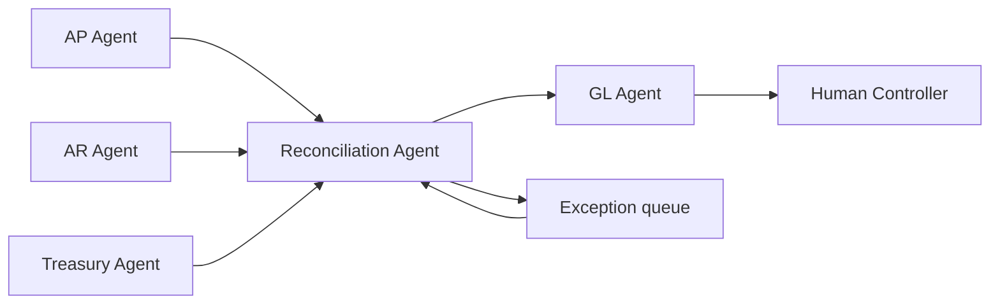

# Multi-Agent Finance Close Orchestrator

**Multi-Agent Systems · runnable synthetic prototype**

A dependency-aware close workflow with specialist agents for Accounts Payable, Accounts Receivable, Treasury, reconciliation and General Ledger — plus a **human controller checkpoint** before the close is considered complete.

## Architecture



The demo is intentionally a **state/dependency orchestrator**, not five chatbots pretending to collaborate.

## Example state

After AP, AR and cash-position tasks complete:

```text
reconcile            → EXCEPTION: cash mismatch > tolerance
gl-close             → BLOCKED by reconcile
controller-approval  → BLOCKED by gl-close
```

This is the behavior I want from a real agentic workflow: downstream work does not continue just because an LLM can generate the next sentence.

## Run

```bash
python main.py
python main.py --test
```

## Product / architecture decisions

- specialist boundaries follow real workflow/accountability boundaries
- dependencies are explicit rather than hidden in prompts
- exceptions are first-class states
- consequential close completion retains human approval
- blocked work is visible rather than silently retried forever

## Production metrics

- close cycle time
- exception aging and re-open rate
- automated vs reviewed completion
- reconciliation quality
- number of blocked downstream tasks prevented from executing
- time spent at each human checkpoint

## Production evolution

- durable state store + idempotency keys
- ERP / data tools behind permissioned tool contracts
- timeout, retry and dead-letter semantics per task
- event-driven orchestration and replay
- audit trail connecting agent action → evidence → human approval
- MAUTAM evals on workflow completion, trust and business impact

**Product thesis:** multi-agent architecture is useful when it mirrors a real multi-stage workflow. Agent count by itself is not sophistication.
