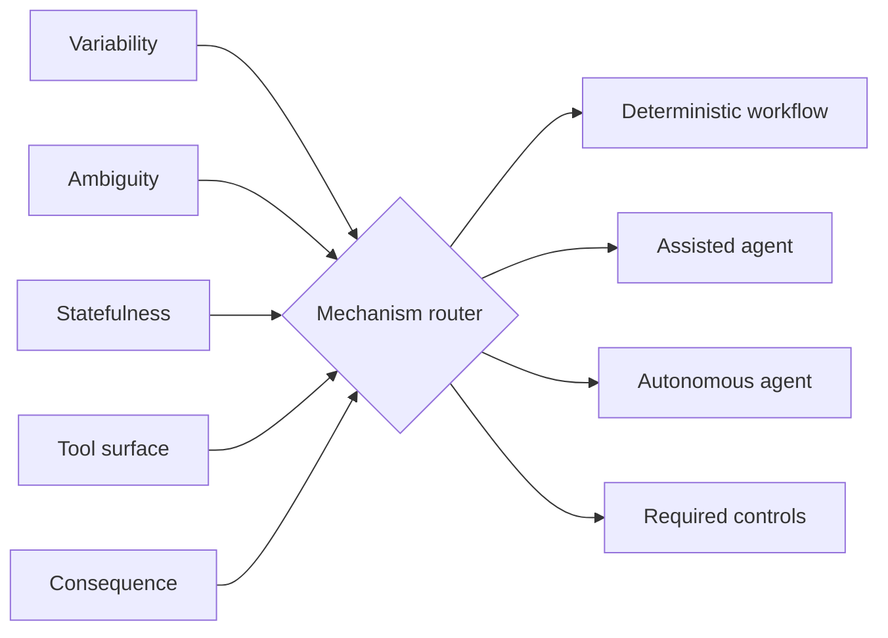

# Agent vs Workflow Router

`Python · agent architecture · mechanism selection`

An agent is a mechanism choice, not the default. This router scores task variability, ambiguity, statefulness, tool surface and consequence, then selects a **deterministic workflow**, **assisted agent** or **autonomous agent**.

Consequence has the strongest effect on autonomy. A highly variable task can still belong in a controlled workflow when a wrong action is expensive or hard to reverse.

## Architecture



The selected mechanism also drives controls: higher consequence adds human approval, broader tool access adds allowlists, and stateful work adds checkpoints.

## Run

```bash
python main.py
python main.py --test
```

## Design choices

- autonomy has to earn its complexity
- consequence reduces the acceptable autonomy level
- tool permissions and recovery are part of the mechanism decision
- predictable work stays deterministic when flexibility adds little value

## Next

Calibrate the thresholds with observed failure cost, task variance, escalation rate and user overrides.
