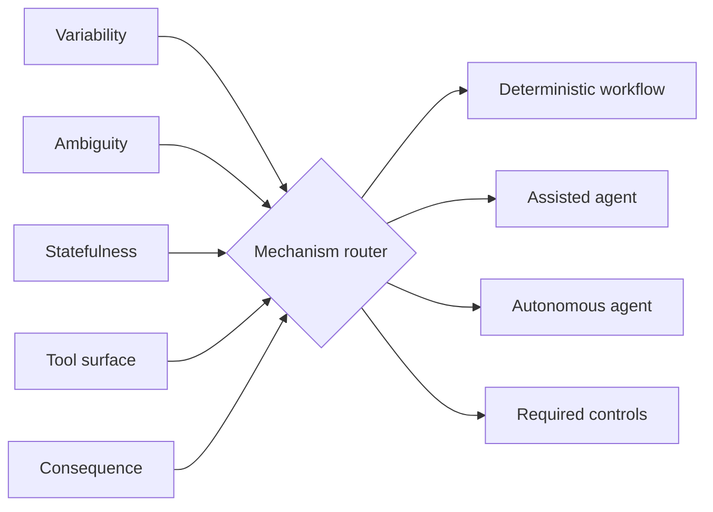

# Agent vs Workflow Router

`Python · agent architecture · mechanism selection`

Before I build an agent, I want a clear reason not to use a normal workflow. This router looks at variability, ambiguity, statefulness, tool surface and consequence, then chooses a **deterministic workflow**, **assisted agent** or **autonomous agent**.

Consequence matters most when deciding how much autonomy to allow. A task can be highly variable and still be the wrong place for autonomous action if a mistake is expensive or hard to reverse.

## Architecture



The router can add controls with the mechanism: higher consequence adds human approval, a larger tool surface adds allowlists, and stateful work adds checkpoints.

## Run

```bash
python main.py
python main.py --test
```

## Design notes

- autonomy is a product choice, not the default
- consequence lowers the amount of autonomy I am comfortable with
- tool permissions and state recovery are part of the routing decision
- deterministic workflows are often the better answer when predictability matters more than flexibility

## Next

I want to calibrate the thresholds with observed failure cost, task variance, escalation rate and user overrides instead of keeping fixed weights.
