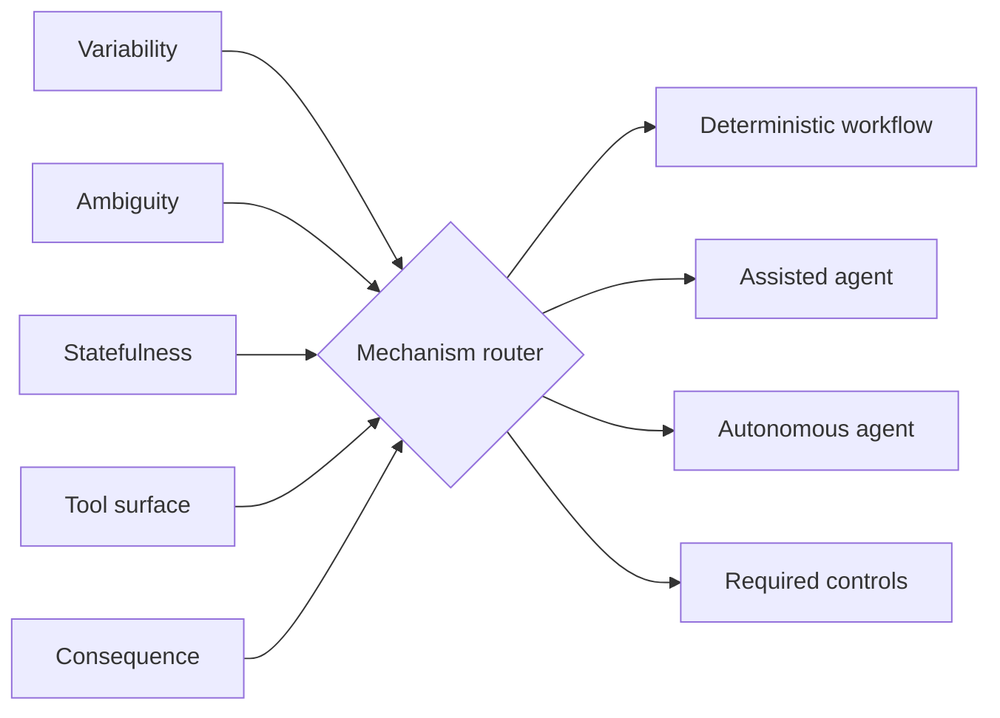

# Agent vs Workflow Router

`Python · agent architecture · mechanism selection`

I built this router to force a mechanism decision before an agent gets designed. It weighs variability, ambiguity, statefulness, tool surface and consequence, then selects a **deterministic workflow**, **assisted agent** or **autonomous agent**.

The important input is consequence. A highly variable task can still be the wrong place for autonomy when a bad action is expensive or hard to reverse.

## Architecture



Controls travel with the mechanism: higher consequence can add human approval; larger tool surfaces add allowlists; stateful work adds checkpoints.

## Run

```bash
python main.py
python main.py --test
```

## Design notes

- agency is a product choice, not an architecture default
- consequence lowers the autonomy ceiling
- tool permissions and state recovery belong in the routing decision
- a deterministic workflow is a successful answer when predictability matters more than flexibility

## Next

I would calibrate the thresholds from observed failure cost, task variance, escalation rate and user override behavior rather than keep fixed weights.
