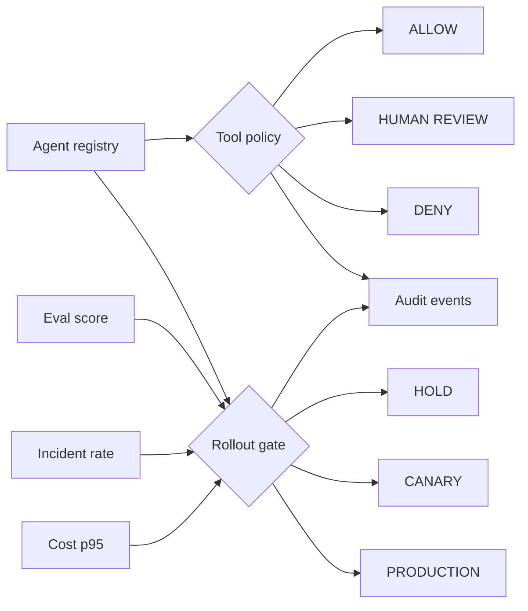

# Agentic Product Control Plane


`Python · AI platform · policy controls`

This models the control surface I expect around agents: **registry, tool permissions, approval boundaries, evaluation gates, cost budgets, incident thresholds, rollout state and audit events**.

The interesting part is not the agent prompt. It is whether the platform can answer three separate questions:

1. **Is this agent registered with the right contract?**
2. **Is this tool call allowed, denied, or waiting for human approval?**
3. **Do current quality / reliability / cost signals permit rollout promotion?**

## What the code models

`AgentSpec` defines registered tools, approval-required tools, rollout stage and quality / cost thresholds.

`authorize_tool(...)` returns an explicit **ALLOW / REVIEW / DENY** policy decision.

`assess_rollout(...)` evaluates quality, incident and cost gates independently from tool authorization and returns **HOLD / CANARY / PRODUCTION** plus blockers and the next action.

`ControlPlane` keeps an in-memory registry and audit trail so the demo can show why a tool or rollout decision changed.

## Architecture



## Run

```bash
python main.py
python main.py --test
```

The browser prototype lives in [`../../docs/control-plane-demo.html`](../../docs/control-plane-demo.html). Public deployment is tracked separately so the repository does not claim a live surface before the URL is independently verified.

## Next

The next step is durable execution state, versioned policy, per-agent rolling budgets and a human approval UI that records reviewer decisions in the audit trail.
