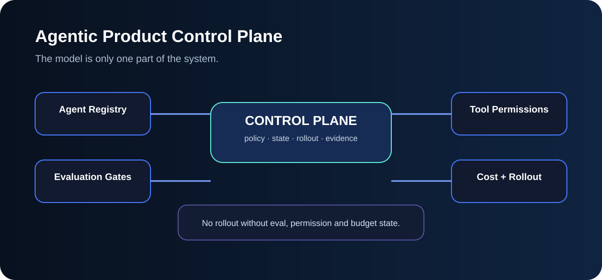
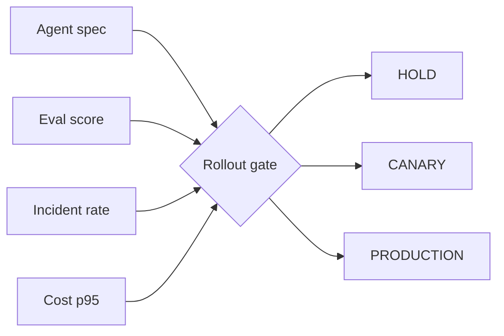

# Agentic Product Control Plane



`Python · AI platform`

This models the control surface I expect around production agents: **registry, tools, eval gates, cost budgets, incident thresholds and rollout state**.

The interesting part is not the agent prompt. It is whether the platform can decide when an agent is allowed to move from **shadow → canary → production**, and why it is being held back.

## Architecture



## Run

```bash
python main.py
python main.py --test
```

The current implementation is deliberately compact, but the boundary is the important part: agent registration and allowed tools are separate from runtime health and promotion policy.
