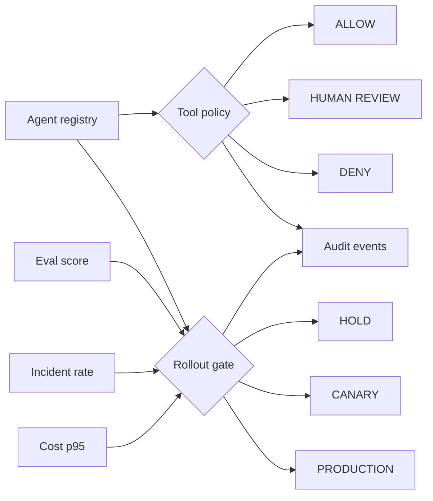

# Agentic Product Control Plane


`Python · AI platform · policy controls`

This project puts the main controls around an agent in one place: **registry, tool permissions, approval boundaries, evaluation gates, cost budgets, incident thresholds, rollout state and audit events**.

I use it to separate three decisions that are easy to blur together:

1. Is the agent registered with the right contract?
2. Is this tool call allowed, denied, or waiting for human approval?
3. Do current quality, reliability and cost signals allow the rollout to advance?

## What the code models

`AgentSpec` defines registered tools, approval-required tools, rollout stage and quality / cost thresholds.

`authorize_tool(...)` returns **ALLOW / REVIEW / DENY**.

`assess_rollout(...)` checks quality, incident and cost gates separately from tool authorization and returns **HOLD / CANARY / PRODUCTION** with blockers and a next action.

`ControlPlane` keeps an in-memory registry and audit trail so the demo can show why a tool or rollout decision changed.

## Architecture



## Run

```bash
python main.py
python main.py --test
```

The browser prototype lives in [`../../docs/control-plane-demo.html`](../../docs/control-plane-demo.html). I keep deployment status separate from the code so the repo does not claim a public URL until it is actually available.

## Next

I want to add durable execution state, versioned policy, rolling per-agent budgets and a human approval UI that records the approval decision in the audit trail.
