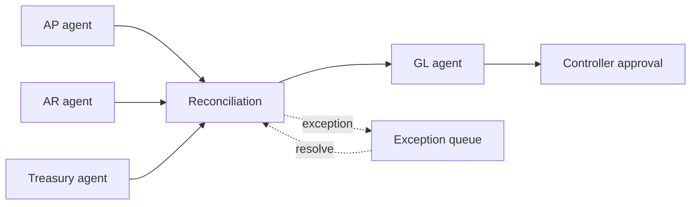

# Finance Close Orchestrator

`Python · multi-agent workflow · fintech`

Finance close is modeled as a dependency-driven workflow across AP, AR, Treasury, reconciliation and GL, with controller approval before completion.

The important state lives in the workflow, not in agent conversation. Downstream work waits for its dependencies, reconciliation exceptions stay visible, and final completion remains a controlled approval state.

## Architecture



## Run

```bash
python main.py
python main.py --test
```

## Design choices

- specialist ownership is explicit
- dependency state is deterministic
- exceptions remain first-class workflow state
- final completion requires controller approval

## Signals

Close-cycle time, exception aging, reconciliation mismatch rate, manual touches, approval latency and reopen rate.

## Next

Persist workflow state, add idempotent execution, event-driven retries, evidence attachments and role-based approval policy.
