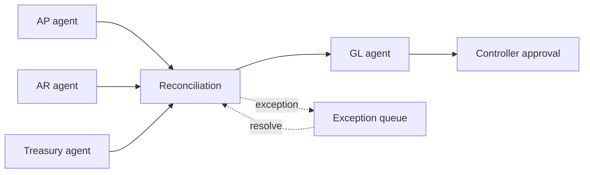

# Finance Close Orchestrator

`Python · multi-agent workflow · fintech`

This models finance close as a dependency-driven workflow across AP, AR, Treasury, reconciliation and GL, with a controller approval before completion.

The orchestration is built around **state, dependencies and exceptions** rather than free-form agent conversation. A downstream stage cannot move until its dependencies are complete, and exceptions remain visible instead of getting buried in a generated summary.

## Architecture



## Run

```bash
python main.py
python main.py --test
```

## Design choices

- specialist ownership is explicit
- dependency state is deterministic
- exceptions stay visible
- final completion remains a human-controlled state

## Signals

Close-cycle time, exception aging, reconciliation mismatch rate, manual touches, approval latency and reopen rate.

## Next

I want to persist workflow state, add idempotent task execution, event-driven retries, evidence attachments and role-based approval policy.
