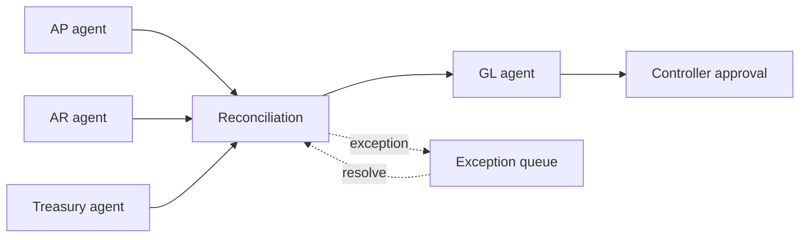

# Finance Close Orchestrator

`Python · multi-agent workflow · fintech`

Finance close is a useful place to model agents as workflow actors rather than chat personas. I represented AP, AR, Treasury, reconciliation and GL as dependency-bound stages, with a controller approval before completion.

## Architecture



The orchestration is built around **state, dependencies and exceptions** rather than free-form agent conversation. A downstream stage cannot advance until its dependency state is satisfied; exceptions remain visible to the controller.

## Run

```bash
python main.py
python main.py --test
```

## Design choices

- specialist ownership is explicit
- dependency state is deterministic
- exceptions do not disappear into a generated summary
- final completion remains a human-controlled state

## Signals

Close-cycle time, exception aging, reconciliation mismatch rate, manual touches, approval latency and reopen rate.

## Next

Persist workflow state, add idempotent task execution, event-driven retries, evidence attachments and role-based approval policy.
