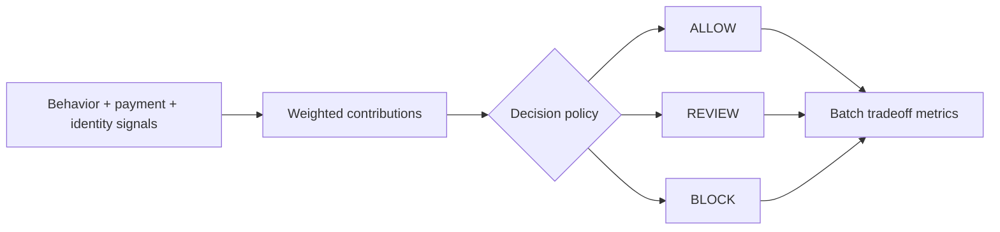

# Fraud Signal Decision Engine


`Python · risk decisioning · policy tradeoffs`

This engine combines behavioral, payment and identity signals into explainable **ALLOW / REVIEW / BLOCK** states.

Fraud containment is only half the product. The decision also has to account for good-user friction and manual-review load.

## What the code models

`DecisionPolicy` keeps review and block thresholds separate from signal weights, so policy can move without rewriting scoring logic.

`decide(...)` returns the score, action, top reason codes, per-signal contributions and the thresholds behind the decision.

`batch_metrics(...)` runs labeled synthetic cases and reports:

- block rate
- review rate
- fraud containment rate
- good-user block rate

## Decision flow



## Run

```bash
python main.py
python main.py --test
```

The data is synthetic. This is a policy and decisioning prototype, not a trained production fraud model.

## Next

Calibrate thresholds against a versioned labeled dataset, model review capacity, break false positives down by cohort and compare expected loss avoided with conversion impact.
