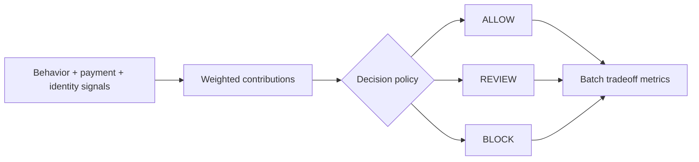

# Fraud Signal Decision Engine


`Python · risk decisioning · policy tradeoffs`

This engine combines behavioral, payment and identity signals into explainable **ALLOW / REVIEW / BLOCK** states.

The goal is not to block as much as possible. A fraud system can reduce loss and still be a poor product if false positives hurt good-user conversion or if too much traffic gets pushed into manual review.

## What the code models

`DecisionPolicy` keeps review and block thresholds separate from signal weights, so policy can change without rewriting the scoring logic.

`decide(...)` returns the score, action, top reason codes, per-signal contributions and the thresholds that produced the decision.

`batch_metrics(...)` runs labeled synthetic cases and reports four product-level tradeoffs:

- block rate
- review rate
- fraud containment rate
- good-user block rate

That makes customer harm and operational load visible alongside fraud containment.

## Decision flow



## Run

```bash
python main.py
python main.py --test
```

The data is synthetic. This is a policy and decisioning prototype, not a trained production fraud model.

## Next

I want to calibrate thresholds against a versioned labeled dataset, track review capacity, break false positives down by customer cohort and compare expected loss avoided with conversion impact.
