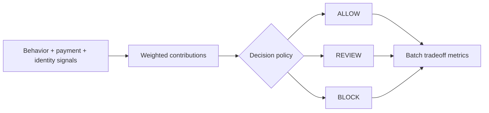

# Fraud Signal Decision Engine


`Python · risk decisioning · policy tradeoffs`

This engine combines behavioral, payment and identity signals into explainable **ALLOW / REVIEW / BLOCK** states.

I am intentionally optimizing for the tradeoff, not maximum blocking. A fraud system can reduce loss and still be a bad product if false positives destroy good-user conversion or push too much volume into manual review.

## What the code models

`DecisionPolicy` separates review and block thresholds from the signal weights so policy can change without rewriting scoring logic.

`decide(...)` returns the score, action, top reason codes, per-signal contributions and the thresholds that produced the decision.

`batch_metrics(...)` runs labeled synthetic cases and exposes four product-level tradeoffs:

- block rate
- review rate
- fraud containment rate
- good-user block rate

That makes it possible to discuss policy quality in terms of customer harm and operational load, not only model score.

## Decision flow



## Run

```bash
python main.py
python main.py --test
```

The data is synthetic by design. The implementation is a policy/decisioning prototype, not a claim of a trained production fraud model.

## Next

A fuller version would calibrate thresholds against a versioned labeled dataset, track review capacity, segment false positives by customer cohort and compare expected loss avoided against conversion impact.
