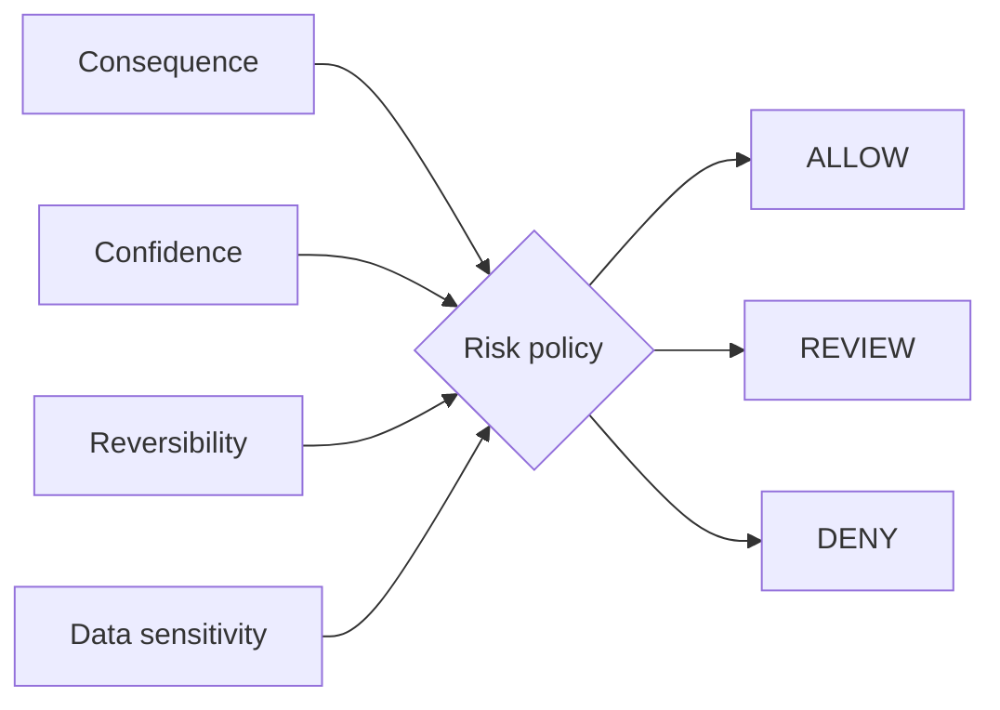

# Human-in-the-Loop Risk Router

`Python · agent safety · policy`

This router uses **consequence, confidence, reversibility and data sensitivity** to choose **ALLOW / REVIEW / DENY**.

I do not want model confidence to decide autonomy by itself. A draft email and an account deletion can have similar confidence scores but very different consequences if something goes wrong.

## Architecture



Reversibility is one of the main controls here: an action that can be safely undone can tolerate more automation than one that cannot.

## Run

```bash
python main.py
python main.py --test
```

## Design tradeoffs

- too much review creates a queue instead of useful automation
- confidence helps, but it does not replace consequence
- sensitive data can raise risk even when an action is technically reversible
- denied actions should have a clear reason instead of failing silently

## Signals

Approval rate, override rate, false escalation, incident severity, rollback success and time saved per reviewed action.

## Next

I want to move from one global policy to capability-level rules with role context, policy versioning and an audit trail.
