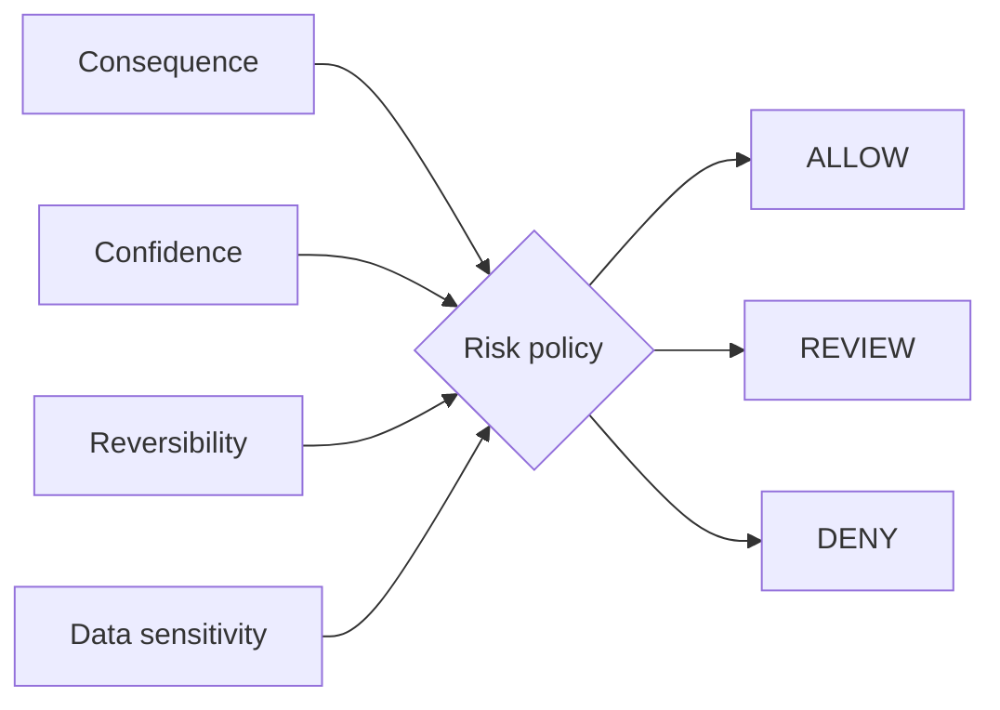

# Human-in-the-Loop Risk Router

`Python · agent safety · policy`

Autonomy should depend on consequence and reversibility, not confidence alone. This router turns **consequence, confidence, reversibility and data sensitivity** into **ALLOW / REVIEW / DENY**.

## Architecture



A draft email and an account deletion can have similar model confidence but should not receive the same autonomy. Reversibility is what makes that distinction operational.

## Run

```bash
python main.py
python main.py --test
```

## Design tradeoffs

- too much review turns automation into queue creation
- confidence is useful but not a substitute for consequence
- sensitive data raises risk even for technically reversible actions
- denial should be explicit and explainable rather than a silent tool failure

## Signals

Approval rate, override rate, false escalation, incident severity, rollback success and time saved per reviewed action.

## Next

Move from one global policy to capability-level rules with role context, policy versioning and an audit trail.
