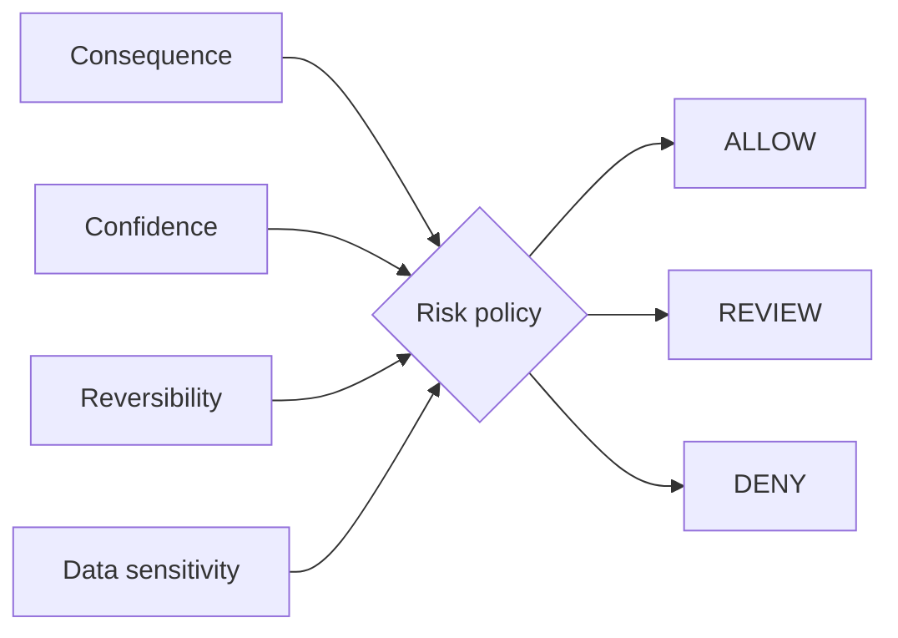

# Human-in-the-Loop Risk Router

`Python · agent safety · policy`

This router uses **consequence, confidence, reversibility and data sensitivity** to choose **ALLOW / REVIEW / DENY**.

Confidence alone is not enough to set autonomy. A draft email and an account deletion can carry similar confidence scores but very different failure costs.

## Architecture



Reversibility changes the control level: an action that can be safely undone can tolerate more automation than an irreversible one.

## Run

```bash
python main.py
python main.py --test
```

## Design tradeoffs

- too much review turns automation into a queue
- confidence informs the decision; consequence sets the ceiling
- sensitive data can increase risk even when an action is reversible
- denied actions return a reason instead of failing silently

## Signals

Approval rate, override rate, false escalation, incident severity, rollback success and time saved per reviewed action.

## Next

Move from one global policy to capability-level rules with role context, policy versioning and an audit trail.
