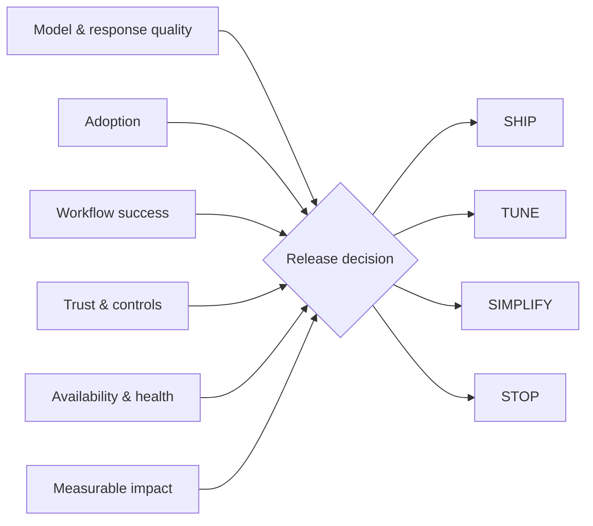

# MAUTAM AI Product Evaluation


`Python · AI evaluation · release gates`

MAUTAM is the scorecard I use to connect model behavior to product behavior:

- **M**odel & Response Quality
- **A**doption
- **U**ser Workflow Success
- **T**rust & Controls
- **A**vailability & Health
- **M**easurable Business Impact

I wanted trust and operational health to act as gates, not numbers a strong response-quality score could average away. The implementation combines a weighted product score with explicit hard stops and produces one of four release states: **SHIP / TUNE / SIMPLIFY / STOP**.

## Architecture



## Decision model

```text
weighted product score
        +
trust / availability hard gates
        ↓
SHIP · TUNE · SIMPLIFY · STOP
```

## Run

```bash
python main.py
python main.py --test
```

## Signals

In a production implementation I would feed this from grounded-response evals, workflow completion, repeat adoption, human-review outcomes, latency/tool failures, availability and a business outcome such as time-to-value, risk reduced or cost avoided.

## What this catches

A strong demo with weak workflow completion. High usage with poor permissions. Great offline scores with failing tools in production. Interesting AI that never earns measurable product value.

## Next

The next version would consume real trace windows, add cohort trends and confidence intervals, and make release gates configurable by capability rather than global.
