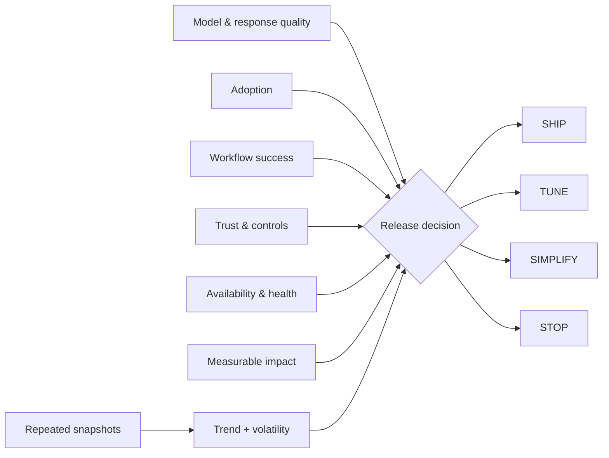

# MAUTAM AI Product Evaluation


`Python · AI evaluation · release gates`

MAUTAM evaluates six parts of AI product health together:

- **M**odel & Response Quality
- **A**doption
- **U**ser Workflow Success
- **T**rust & Controls
- **A**vailability & Health
- **M**easurable Business Impact

The evaluator combines a weighted score with hard trust and availability gates, then returns **SHIP / TUNE / SIMPLIFY / STOP**. A strong response-quality score cannot cancel out a serious control or reliability failure.

## What the code models

1. **Snapshot evaluation** — weighted contributions, weakest lens, configurable thresholds and trust/availability gate failures.
2. **Window evaluation** — average lens health, per-lens volatility and **IMPROVING / STABLE / DEGRADING** trend across repeated snapshots.

One good run is not enough to describe product health; the window view makes trend and volatility visible.

## Architecture



## Decision model

```text
weighted product score
        +
trust / availability hard gates
        +
window trend + volatility
        ↓
SHIP · TUNE · SIMPLIFY · STOP
```

## Run

```bash
python main.py
python main.py --test
```

## Signals

A production implementation would pull from response evals, workflow completion, repeat usage, human-review outcomes, latency, tool failures, availability and a business outcome such as time-to-value, risk reduced or cost avoided.

## What it catches

- good model output with weak workflow completion
- high usage with poor controls
- strong offline scores with failing tools
- healthy point-in-time scores masking a deteriorating trend

## Next

Add versioned trace windows, cohort trends, confidence intervals and capability-specific gates.
