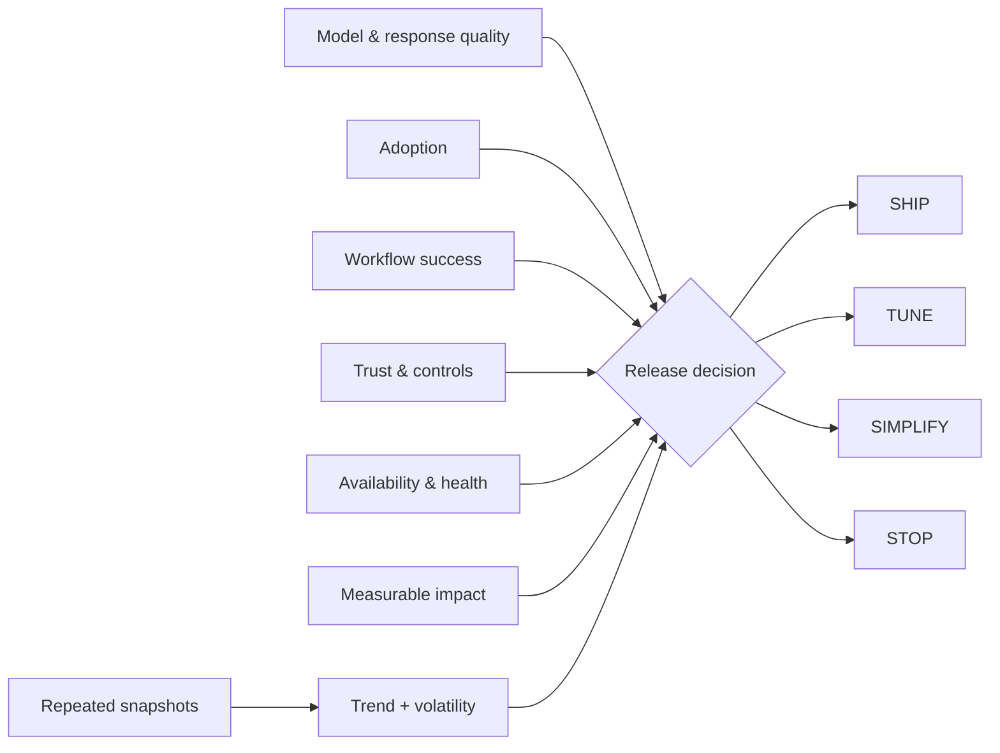

# MAUTAM AI Product Evaluation


`Python · AI evaluation · release gates`

MAUTAM is a product-level scorecard for six things I want to see together when evaluating an AI capability:

- **M**odel & Response Quality
- **A**doption
- **U**ser Workflow Success
- **T**rust & Controls
- **A**vailability & Health
- **M**easurable Business Impact

The current version combines a weighted score with hard gates for trust and availability, so a strong response-quality score cannot hide a serious control or reliability problem. The output is **SHIP / TUNE / SIMPLIFY / STOP**.

## What the code models

There are two evaluation levels:

1. **Snapshot evaluation** — weighted contributions, weakest-lens detection, configurable release thresholds and explicit trust / availability gate failures.
2. **Window evaluation** — average lens health, per-lens volatility and an improving / stable / degrading trend across repeated snapshots.

The window view is there because one good run is not enough to describe product health.

## Architecture



## Decision model

```text
weighted product score
        +
trust / availability hard gates
        +
window trend + volatility
        ↓
SHIP · TUNE · SIMPLIFY · STOP
```

## Run

```bash
python main.py
python main.py --test
```

## Signals

A fuller implementation would pull from grounded-response evals, workflow completion, repeat usage, human-review outcomes, latency and tool failures, availability, and a business outcome such as time-to-value, risk reduced or cost avoided.

## What it catches

Examples: good model output with weak workflow completion, high usage with poor controls, strong offline scores with failing tools, or a point-in-time score that looks healthy while the underlying trend is getting worse.

## Next

I want to add versioned trace windows, cohort trends, confidence intervals and capability-specific gates instead of one global threshold set.
