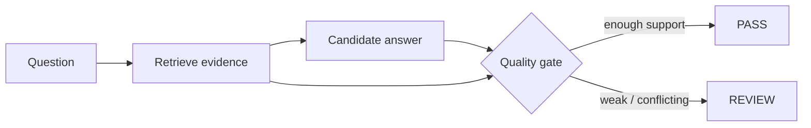

# Grounded RAG Quality Gate

`Python · RAG · evaluation`

This project checks **evidence coverage**, **citation validity** and **contradiction risk** before an answer is released.

Fluency does not count as evidence. Weak or conflicting support routes the answer to review instead of letting confidence in the wording decide.

## Architecture



The gate sits outside the generator, which keeps the grounding decision easier to test and audit.

## Run

```bash
python main.py
python main.py --test
```

## Signals

Retrieval recall, citation precision, unsupported-claim rate, contradiction rate, escalation rate, latency and task completion after the answer.

## Failure cases

- retrieved context misses a required fact
- citations exist but do not support the claim
- sources disagree and the answer presents one confident conclusion
- fluent wording hides low evidence coverage

## Next

Add claim-level entailment, source authority and recency, semantic retrieval, golden-query sets and domain-specific thresholds.
