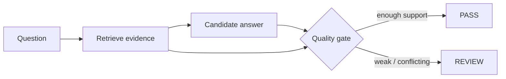

# Grounded RAG Quality Gate

`Python · RAG · evaluation`

This project checks **evidence coverage**, **citation validity** and **contradiction risk** before an answer is released.

The point of the gate is simple: a fluent answer should not pass just because it sounds confident. If the retrieved evidence is weak or conflicting, the system should be able to stop and route the answer for review.

## Architecture



The gate runs outside the generator so the grounding decision is easier to inspect and test.

## Run

```bash
python main.py
python main.py --test
```

## Signals

Retrieval recall, citation precision, unsupported-claim rate, contradiction rate, escalation rate, latency and task completion after the answer.

## Failure cases

- retrieved context misses a required fact
- citations exist but do not support the claim
- sources disagree and the answer presents one confident conclusion
- fluent wording hides low evidence coverage

## Next

I want to add claim-level entailment, source authority and recency, semantic retrieval, golden-query sets and per-domain thresholds.
