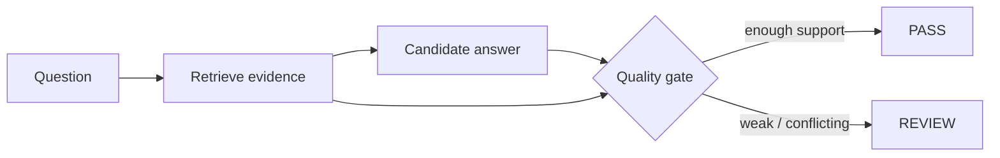

# Grounded RAG Quality Gate

`Python · RAG · evaluation`

I wanted a release gate that can stop a fluent answer when the evidence is weak. This project scores **evidence coverage**, **citation validity** and **contradiction risk** before an answer is released.

## Architecture



The gate is deliberately outside the generator. Asking a model to judge its own grounding in the same step can make the failure harder to inspect.

## Run

```bash
python main.py
python main.py --test
```

## Signals

I would track retrieval recall, citation precision, unsupported-claim rate, contradiction rate, escalation rate, latency and task completion after the answer.

## Failure cases

- retrieved context misses a required fact
- citations exist but do not support the claim
- sources disagree and the answer collapses them into one confident statement
- answer fluency hides low coverage

## Next

Add claim-level entailment, source authority/recency, semantic retrieval, golden-query sets and per-domain thresholds.
